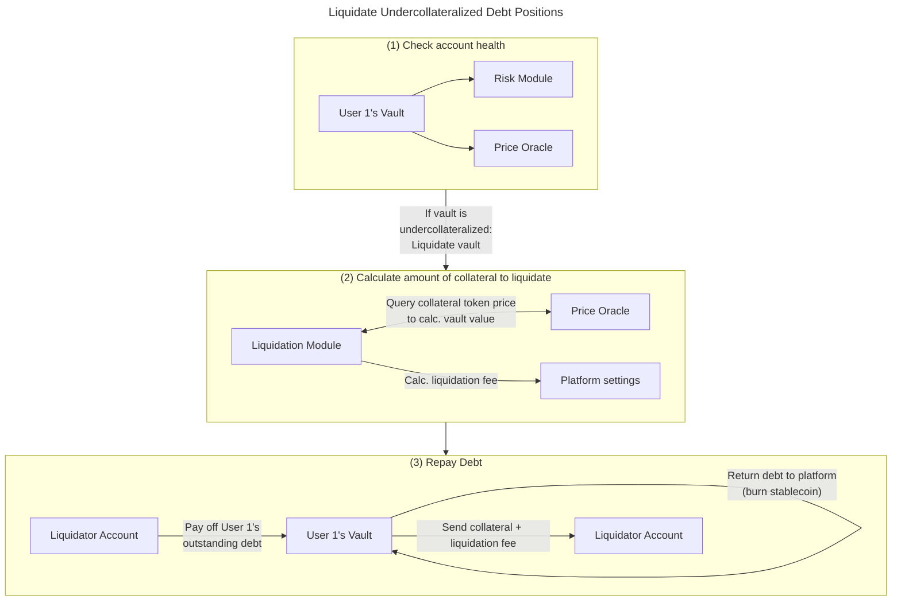

<!-- ```mermaid -->
<!-- %%subgraph borrow[Borrow against collateral] -->
<!-- %%         vault1[User 1's Vault] -->
<!-- %%         risk1[Risk Module] -->
<!-- %%         oracle1[Price Oracle] -->
<!-- %%         vault1 --\> risk1 & oracle1 --\> vault2[User 1's Vault] -->
<!-- %%         vault2 -- "Issue debt\n(mint stablecoin to User 1)" --\> user2[User 1] -->
<!-- %%end -->
<!-- %%user[User 1] -- "Deposit collateral (tokens)" --\> vault1 -->
<!-- ``` -->
